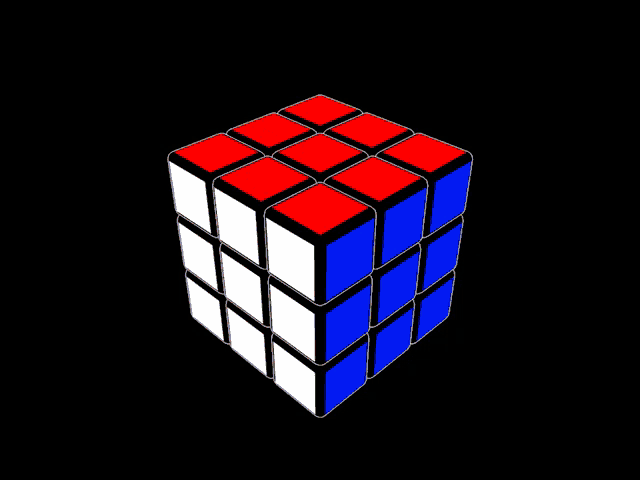

# Puzzle Solver

A complete Rubik's Cube scanning and solving system built with Python, OpenCV, and FastAPI.
This repo contains the core solver, a web API, and a CLI tool for webcam-based cube capture.



## Project Overview

This monorepo contains three components:

<pre>
puzzle-solver/
├── puzzle_solver_core/   # Core cube logic, HSV extraction, Kociemba interface
├── puzzle_solver_api/    # FastAPI backend for scanning & solving
└── puzzle_solver_cli/    # CLI webcam tool for capturing cube faces
</pre>

The system supports:

- Cube face scanning (via CLI or client apps)
- HSV extraction + color classification
- Building a validated Cube model
- Solving using the Kociemba algorithm
- A versioned REST API for scanning and solving

## Running the API Locally

```bash
uvicorn puzzle_solver_api.main:app --reload
```

## API Endpoints (v1)

**Scanning**

- **`POST /v1/scans`**

  - Upload 6 cube-face images → returns color labels
  - Add `?hsv_debug=true` to include HSV debug data.

- **`POST /v1/scans/hsv`**
  - Returns HSV matrices only

**Solving**

- **`POST /v1/solutions`**
  - Submit classified cube faces → returns solution move sequence
    (Uses the Kociemba library internally)

## CLI Usage

```bash
python puzzle_solver_cli/cli_main.py
```

Press `s` to capture each face. After 6 faces, the solution is printed to the console

## License

MIT License

## Expansions

This repository is a work in progress.

Suggestions and improvements are welcome!
