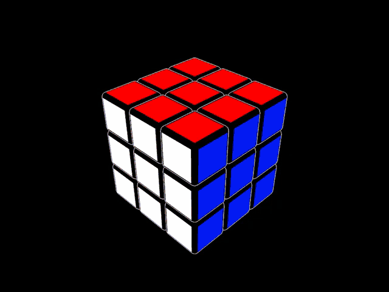

# puzzle-solver
Using computer vision and graph algorithm methodologies to probabilistically solve a Rubik's cube in the fewest moves possible.

If we allow each possible state of the Rubik's cube (3x3x3) to represent a node in an undirected graph and each edge to represent a connection between one possible state to the next, our algorithm should be looking to eventually go from our scrambled state to our solved state with a certain number of moves (20 being the known limit to how few moves it takes with an average being ~18 for a 3x3)

Considering a Rubik's cube contains over 43 quintillion (43 with 18 zeros after!), our approach must be conscious of the amount of space our algorithm could potentially use, while utilizing some kind of heuristic to narrow the search space as we go on. Here is where IDA* (iterative deepending A*) comes into play.

This project's goal is to utilize OpenCV to capture input about our Rubik's cube and using this algorithm to output a sequence of moves to perform to solve our cube in probabilistically optimal number of moves.

I encourage you to read more about IDA* here: [Finding Optimal Solutions to Rubik's Cube
Using Pattern Databases ](https://www.cs.princeton.edu/courses/archive/fall06/cos402/papers/korfrubik.pdf)



# Installation
1. Clone the repository:
   ```bash
   git clone https://github.com/calebgetahun/puzzle-solver.git
2. Navigate to project directory:
    ```bash
    cd puzzle-solver
2. Install requirements (I'd recommend to do this inside a virtual environment):
    ```bash
    pip install -r requirements.txt
# Usage
1. Run the main script:
    ```bash
    python main.py
2. Make sure you have a camera linked to your device (should be complete if done on a laptop/pc with connecting webcam)
3. Follow instructions to take photos of each side
4. Solution time!!
# Expansions
Note this repository **is** a work in progress\
Please let me know if you have any suggestions/ways the project can be improved!